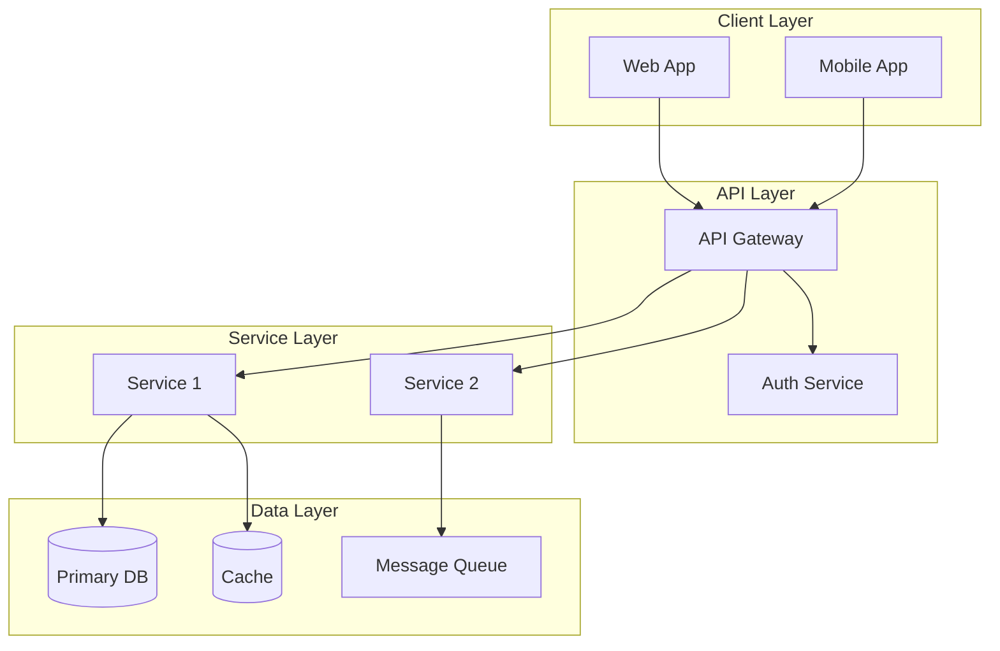
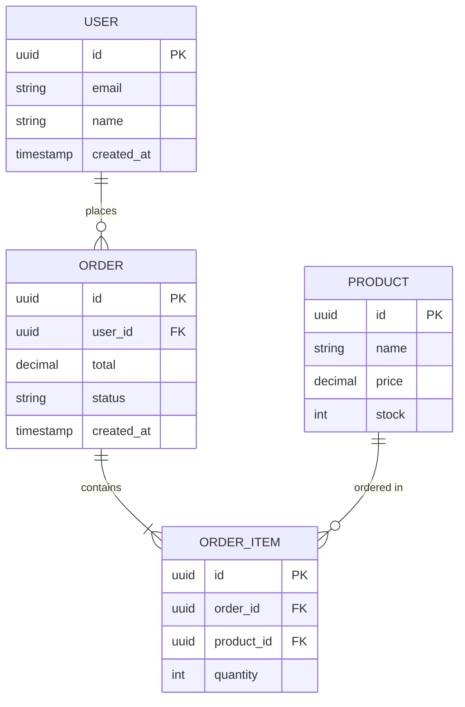
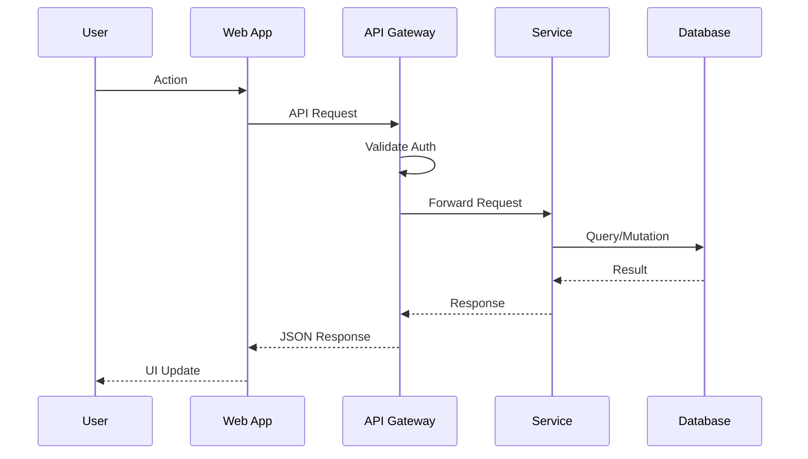
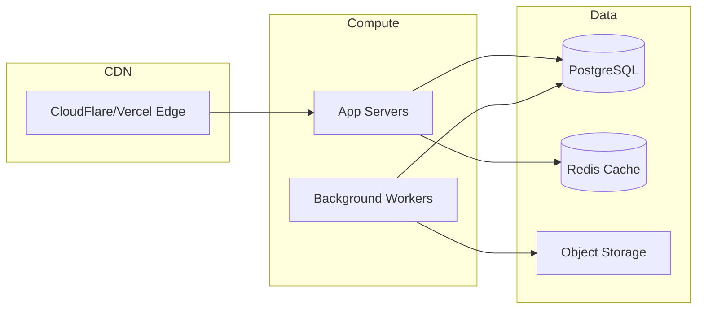
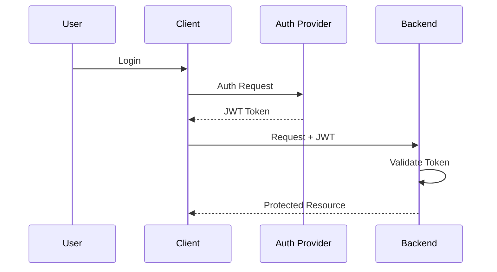

# Architecture Document: [Project Name]

> **Source**: [SPEC.md](../SPEC.md) | **Status**: Draft

## 1. Executive Summary

### Overview
[One paragraph describing the system architecture and key design decisions]

### Key Decisions
| Decision | Choice | Rationale |
|----------|--------|-----------|
| API Style | [REST/GraphQL/gRPC] | [Why] |
| Database | [PostgreSQL/MongoDB/etc] | [Why] |
| Hosting | [Serverless/Containers/VMs] | [Why] |

---

## 2. System Overview

### High-Level Architecture Diagram

### Component Summary
| Component | Technology | Responsibility |
|-----------|------------|----------------|
| Web App | [Next.js/React] | User interface |
| API Gateway | [Kong/AWS API GW] | Request routing, rate limiting |
| Auth Service | [Clerk/Auth0/Custom] | Authentication, authorization |
| Primary DB | [PostgreSQL] | Persistent data storage |

---

## 3. Component Breakdown

### 3.1 [Component Name]
**Purpose**: [What this component does]

**Responsibilities**:
- [Responsibility 1]
- [Responsibility 2]

**Interfaces**:
| Interface | Type | Description |
|-----------|------|-------------|
| [/api/v1/resource] | REST | [Purpose] |

**Dependencies**:
- [Depends on Component X for Y]

---

## 4. Data Model

### Entity Relationship Diagram

### Entity Descriptions
| Entity | Description | Key Relationships |
|--------|-------------|-------------------|
| USER | System user account | Has many ORDERs |
| ORDER | Purchase transaction | Belongs to USER, has ORDER_ITEMs |

---

## 5. Data Flow

### Primary User Flow

---

## 6. Infrastructure Schema

### Cloud Resources

### Resource Specifications
| Resource | Type | Specs | Est. Cost/mo |
|----------|------|-------|--------------|
| App Servers | [Vercel/EC2/Cloud Run] | [Specs] | [$X] |
| Database | [RDS/Supabase/Neon] | [Specs] | [$X] |
| Cache | [ElastiCache/Upstash] | [Specs] | [$X] |

---

## 7. Security Architecture

### Authentication Flow

### Security Measures
| Layer | Measure | Implementation |
|-------|---------|----------------|
| Transport | TLS 1.3 | All traffic encrypted |
| Auth | JWT + Refresh | Short-lived access tokens |
| AuthZ | RBAC | Role-based permissions |
| Data | Encryption at rest | AES-256 |
| Secrets | Vault/SSM | No hardcoded secrets |

---

## 8. Scalability Strategy

### Horizontal Scaling
| Component | Strategy | Trigger |
|-----------|----------|---------|
| App Servers | Auto-scale | CPU > 70% |
| Workers | Queue-based | Queue depth > 100 |
| Database | Read replicas | Read load > threshold |

### Performance Targets
| Metric | Target | Measurement |
|--------|--------|-------------|
| API p95 Latency | < 200ms | APM |
| Availability | 99.9% | Uptime monitoring |
| RPS | 1000+ | Load testing |

---

## 9. Requirement Traceability

| SPEC Requirement | Component(s) | Notes |
|------------------|--------------|-------|
| FR-001: [Description] | [Service X] | [Implementation approach] |
| FR-002: [Description] | [Service Y, Component Z] | [Notes] |
| NFR-001: Performance | [Caching, CDN] | [Strategy] |

---

## 10. Open Questions & Decisions

| Question | Options | Decision | Owner |
|----------|---------|----------|-------|
| [Question 1] | A, B, C | Pending | [Name] |

---

## Appendix

### A. Technology Justifications
[Detailed rationale for major technology choices]

### B. Rejected Alternatives
| Option | Reason for Rejection |
|--------|---------------------|
| [Alt 1] | [Why not chosen] |

### C. References
- [Link to SPEC.md](../SPEC.md)
- [Link to PRD.md](../PRD.md)
