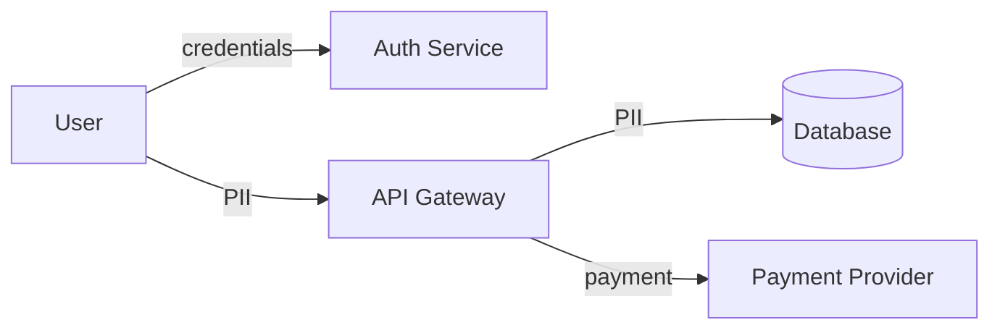

# Risk Assessment Report: [Project Name]

> **Source Documents**: [PRD.md](../PRD.md), [SPEC.md](../SPEC.md), [ARCHITECTURE.md](../ARCHITECTURE.md)  
> **Date**: [Date]  
> **Status**: Draft

---

## 1. Executive Summary

### Risk Profile
| Category | Critical | High | Medium | Low |
|----------|----------|------|--------|-----|
| Security | 0 | 0 | 0 | 0 |
| Infrastructure | 0 | 0 | 0 | 0 |
| Compliance | 0 | 0 | 0 | 0 |
| Cost | 0 | 0 | 0 | 0 |

### Key Findings
1. [Most critical finding]
2. [Second most critical]
3. [Third most critical]

### Recommended Actions
- [ ] [Top priority action]
- [ ] [Second priority]
- [ ] [Third priority]

---

## 2. Security Risk Analysis

### 2.1 Threat Model (STRIDE)

| Threat | Component | Risk | Mitigation |
|--------|-----------|------|------------|
| **S**poofing | [Auth] | [Level] | [Mitigation] |
| **T**ampering | [Data] | [Level] | [Mitigation] |
| **R**epudiation | [Logs] | [Level] | [Mitigation] |
| **I**nformation Disclosure | [API] | [Level] | [Mitigation] |
| **D**enial of Service | [Server] | [Level] | [Mitigation] |
| **E**levation of Privilege | [Auth] | [Level] | [Mitigation] |

### 2.2 OWASP Top 10 Analysis

| Risk | Applicable? | Current Status | Mitigation |
|------|-------------|----------------|------------|
| A01: Broken Access Control | Yes/No | [Status] | [Plan] |
| A02: Cryptographic Failures | Yes/No | [Status] | [Plan] |
| A03: Injection | Yes/No | [Status] | [Plan] |
| A04: Insecure Design | Yes/No | [Status] | [Plan] |
| A05: Security Misconfiguration | Yes/No | [Status] | [Plan] |
| A06: Vulnerable Components | Yes/No | [Status] | [Plan] |
| A07: Auth Failures | Yes/No | [Status] | [Plan] |
| A08: Integrity Failures | Yes/No | [Status] | [Plan] |
| A09: Logging Failures | Yes/No | [Status] | [Plan] |
| A10: SSRF | Yes/No | [Status] | [Plan] |

### 2.3 Sensitive Data Flows

| Data Type | Classification | Locations | Protection |
|-----------|---------------|-----------|------------|
| Credentials | Critical | Auth service | Bcrypt, TLS |
| PII | Sensitive | Database | Encryption at rest |
| Payment | Critical | External provider | Tokenization |

---

## 3. Infrastructure Risk Analysis

### 3.1 Single Points of Failure

| Component | SPOF? | Impact | Mitigation |
|-----------|-------|--------|------------|
| Database | Yes/No | [Impact] | [e.g., Multi-AZ, read replicas] |
| API Server | Yes/No | [Impact] | [e.g., Load balancer, auto-scaling] |
| Auth Provider | Yes/No | [Impact] | [e.g., Fallback, caching] |

### 3.2 Scalability Bottlenecks

| Component | Current Limit | Expected Load | Risk | Mitigation |
|-----------|---------------|---------------|------|------------|
| [Component] | [Limit] | [Load] | [Level] | [Plan] |

### 3.3 Disaster Recovery

| Metric | Target | Current | Gap |
|--------|--------|---------|-----|
| RPO (Recovery Point) | [e.g., 1 hour] | [Current] | [Gap] |
| RTO (Recovery Time) | [e.g., 4 hours] | [Current] | [Gap] |
| Backup Frequency | [Target] | [Current] | [Gap] |

---

## 4. Compliance Analysis

### 4.1 Applicable Regulations

| Regulation | Applicable? | Reason | Status |
|------------|-------------|--------|--------|
| GDPR | Yes/No | [EU users?] | [Status] |
| CCPA | Yes/No | [CA users?] | [Status] |
| SOC 2 | Yes/No | [Enterprise?] | [Status] |
| HIPAA | Yes/No | [Health data?] | [Status] |
| PCI DSS | Yes/No | [Payments?] | [Status] |

### 4.2 Compliance Gaps

| Requirement | Status | Gap | Remediation |
|-------------|--------|-----|-------------|
| Privacy Policy | ✅/❌ | [Gap] | [Action] |
| User Data Export | ✅/❌ | [Gap] | [Action] |
| Right to Delete | ✅/❌ | [Gap] | [Action] |
| Consent Management | ✅/❌ | [Gap] | [Action] |

---

## 5. Cost Risk Analysis

### 5.1 Estimated Monthly Costs

| Resource | Units | Unit Cost | Monthly Est. | Notes |
|----------|-------|-----------|--------------|-------|
| Compute | [N] instances | $[X]/mo | $[Total] | [Notes] |
| Database | [Size] | $[X]/mo | $[Total] | [Notes] |
| Storage | [Size] GB | $[X]/GB | $[Total] | [Notes] |
| CDN/Bandwidth | [Size] TB | $[X]/TB | $[Total] | [Notes] |
| Third-party services | - | $[X]/mo | $[Total] | [Notes] |
| **Total** | - | - | **$[Total]** | - |

### 5.2 Cost Risks

| Risk | Trigger | Impact | Mitigation |
|------|---------|--------|------------|
| Traffic spike | Viral growth | $[X]/day overrun | Auto-scaling limits |
| Data growth | User uploads | +$[X]/month | Lifecycle policies |
| Vendor price increase | Contract end | +[X]% | Multi-cloud option |

---

## 6. Risk Register

| ID | Risk | Category | Likelihood | Impact | Severity | Owner | Mitigation | Status |
|----|------|----------|------------|--------|----------|-------|------------|--------|
| R01 | [Risk] | Security | [1-5] | [1-5] | [Score] | [Name] | [Plan] | Open |
| R02 | [Risk] | Infra | [1-5] | [1-5] | [Score] | [Name] | [Plan] | Open |

---

## 7. Recommendations

### Immediate Actions (Before Launch)
1. [ ] [Critical action 1]
2. [ ] [Critical action 2]

### Short-term (First 30 days)
1. [ ] [Important action]
2. [ ] [Important action]

### Long-term (Roadmap)
1. [ ] [Strategic action]
2. [ ] [Strategic action]

---

## Appendix

### A. Security Checklist
- [ ] All endpoints require authentication
- [ ] HTTPS enforced everywhere
- [ ] Security headers configured
- [ ] Dependency scanning enabled
- [ ] Secrets in secrets manager
- [ ] Audit logging enabled

### B. References
- [OWASP Top 10](https://owasp.org/Top10/)
- [STRIDE Threat Model](https://docs.microsoft.com/en-us/azure/security/develop/threat-modeling-tool-threats)
